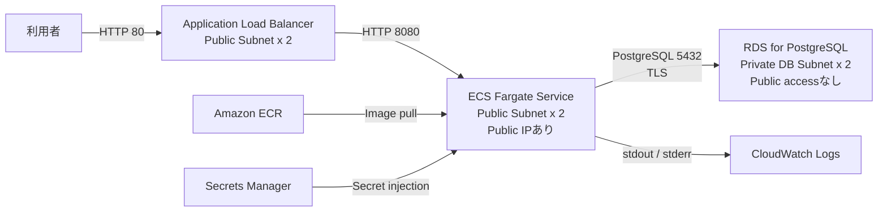

# AWSデプロイ設計・手順

## 1. 目的

クレクレデンシャルAPIを、Amazon ECS on AWS FargateとAmazon RDS for PostgreSQLへデプロイするための構成と作業順を整理する。

この文書では、AWS学習と費用の抑制を両立する「学習環境」を先に構築し、必要になった時点で「本番相当構成」へ拡張する。

実際にAWSリソースを作成すると料金が発生する。作成前にAWS Pricing Calculatorでリージョン、稼働時間、RDS、ALB、Fargate、NAT GatewayまたはVPC Endpointの費用を確認する。

## 2. 採用構成

### 2.1 学習環境



FargateタスクへパブリックIPを付けるのは、NAT Gatewayや複数のInterface VPC Endpointを最初から作らず、ECR、Secrets Manager、CloudWatch Logsへ到達させるためである。

タスクのSecurity GroupはALBのSecurity Groupからの8080番ポートだけを許可する。パブリックIPが付いていても、インターネットからタスクへ直接接続できないようにする。

### 2.2 本番相当への拡張

- Fargateタスクをプライベートサブネットへ移す
- `assignPublicIp` を無効にする
- NAT Gateway、または以下のVPC Endpointを追加する
  - ECR API Interface Endpoint
  - ECR DKR Interface Endpoint
  - S3 Gateway Endpoint
  - CloudWatch Logs Interface Endpoint
  - Secrets Manager Interface Endpoint
- ALBをHTTPS化し、ACM証明書を設定する
- RDSをMulti-AZにする
- ECSの希望タスク数を2以上にする
- AWS WAF、Route 53、CloudWatch Alarmを追加する

## 3. リージョンと命名

| 項目 | 推奨値 |
| --- | --- |
| リージョン | `ap-northeast-1` |
| システム名 | `kurekure-credential` |
| 環境名 | `dev` |
| ECR Repository | `kurekure-credential` |
| ECS Cluster | `kurekure-credential-dev` |
| ECS Service | `kurekure-credential-api-dev` |
| Task Definition Family | `kurekure-credential-api-dev` |
| CloudWatch Log Group | `/ecs/kurekure-credential/dev` |
| RDS DB名 | `kurekure_credential` |

AWSリソースには可能な範囲で以下のタグを付ける。

| キー | 値 |
| --- | --- |
| `Project` | `kurekure-credential` |
| `Environment` | `dev` |
| `ManagedBy` | `manual` または将来使用するIaC名 |

## 4. ネットワーク

### 4.1 VPC

| リソース | 値 |
| --- | --- |
| VPC CIDR | `10.20.0.0/16` |
| Public Subnet A | `10.20.0.0/24` |
| Public Subnet C | `10.20.1.0/24` |
| Private DB Subnet A | `10.20.10.0/24` |
| Private DB Subnet C | `10.20.11.0/24` |

- Public SubnetはInternet Gatewayへのデフォルトルートを持つ
- Private DB Subnetはインターネットへのルートを持たない
- RDS用に2つのPrivate DB SubnetからDB Subnet Groupを作成する

### 4.2 Security Group

| Security Group | Inbound | Outbound |
| --- | --- | --- |
| ALB SG | TCP 80を `0.0.0.0/0` から許可 | ECS SGのTCP 8080 |
| ECS SG | TCP 8080をALB SGからのみ許可 | 全許可で開始し、後から絞る |
| RDS SG | TCP 5432をECS SGからのみ許可 | デフォルト |

RDSは `Publicly accessible: No` とする。RDS SGへ自宅IPや `0.0.0.0/0` を登録しない。

## 5. RDS for PostgreSQL

学習環境の初期値:

| 項目 | 値 |
| --- | --- |
| Engine | PostgreSQL 16 |
| Template | Free tierまたはDev/Test |
| Instance class | リージョンで利用可能な最小クラスを選択 |
| Multi-AZ | No |
| Storage | gp3、最小容量から開始 |
| Public access | No |
| Database name | `kurekure_credential` |
| Backup retention | 1日以上 |
| Deletion protection | 学習中は運用方針に合わせて選択 |

アプリケーションのJDBC URL:

```txt
jdbc:postgresql://<RDS_ENDPOINT>:5432/kurekure_credential?sslmode=require
```

`sslmode=require` で通信を暗号化する。本番相当ではRDS CA証明書をコンテナのTrust Storeへ追加し、`sslmode=verify-full` を検討する。

アプリ起動時にFlywayがV1からV3までを適用する。初回起動後はCloudWatch Logsでマイグレーション成功を確認する。

## 6. シークレット

Secrets Managerに以下を個別のSecretとして作成する。

| Secret | ECS環境変数 |
| --- | --- |
| `/kurekure-credential/dev/db-username` | `DB_USERNAME` |
| `/kurekure-credential/dev/db-password` | `DB_PASSWORD` |
| `/kurekure-credential/dev/jwt-secret` | `JWT_SECRET` |

JWT Secretは十分に長いランダム値を使用する。Git、Dockerfile、Task Definitionの平文 `environment` へ秘密値を書かない。

Secretを更新しただけでは起動済みタスクへ反映されない。ECS ServiceでForce new deploymentを実行して新しいタスクを起動する。

## 7. ECRへのイメージ登録

PowerShell例:

```powershell
$region = "ap-northeast-1"
$accountId = aws sts get-caller-identity --query Account --output text
$repository = "kurekure-credential"
$tag = git rev-parse --short HEAD
$image = "$accountId.dkr.ecr.$region.amazonaws.com/${repository}:$tag"

aws ecr create-repository `
  --repository-name $repository `
  --image-tag-mutability IMMUTABLE `
  --image-scanning-configuration scanOnPush=true `
  --region $region

aws ecr get-login-password --region $region |
  docker login `
    --username AWS `
    --password-stdin "$accountId.dkr.ecr.$region.amazonaws.com"

docker build --platform linux/amd64 -t "${repository}:$tag" .
docker tag "${repository}:$tag" $image
docker push $image
```

Repositoryが既に存在する場合、`create-repository` は省略する。ECS Task Definitionでは `latest` ではなくGit Commit由来の固定タグを指定する。

## 8. IAM

### 8.1 Task Execution Role

用途:

- ECRからイメージを取得する
- CloudWatch Logsへログを送信する
- Secrets Managerから起動時シークレットを取得する

`AmazonECSTaskExecutionRolePolicy` を基礎にし、対象Secret ARNだけへ `secretsmanager:GetSecretValue` を追加する。カスタマー管理KMS Keyを使う場合は対象Keyへの `kms:Decrypt` も追加する。

### 8.2 Task Role

現在のアプリはAWS APIを直接呼ばないため、権限を追加しない最小Task Roleとする。S3などを実装した段階で必要な権限だけを追加する。

## 9. ECS Task Definition

テンプレートは `deploy/ecs-task-definition.example.json` を使用する。

学習環境の初期値:

| 項目 | 値 |
| --- | --- |
| Launch type | Fargate |
| Network mode | `awsvpc` |
| OS / Architecture | Linux / X86_64 |
| CPU | 256 units |
| Memory | 512 MiB |
| Container port | 8080 |
| Runtime user | DockerfileのUID `10001` |
| Log driver | `awslogs` |
| Log retention | 14日から開始 |

メモリ不足になる場合は、最初にTask Definitionを512 CPU / 1024 MiBへ変更して再確認する。

## 10. ALBとECS Service

### 10.1 Target Group

| 項目 | 値 |
| --- | --- |
| Target type | `ip` |
| Protocol / Port | HTTP / 8080 |
| Health check path | `/actuator/health/readiness` |
| Success code | `200` |

### 10.2 ECS Service

| 項目 | 値 |
| --- | --- |
| Desired tasks | 1 |
| Public IP | Enabled |
| Subnets | Public Subnet A / C |
| Security Group | ECS SG |
| Deployment minimum healthy percent | 100 |
| Deployment maximum percent | 200 |
| Health check grace period | 60秒 |

ALB Listenerは学習環境ではHTTP 80からTarget Groupへ転送する。本番相当ではHTTPをHTTPSへリダイレクトし、HTTPS 443にACM証明書を設定する。

## 11. デプロイ後の確認

1. ECS ServiceのDesired countとRunning countが一致する
2. Target Groupの対象がHealthyになる
3. CloudWatch LogsにFlyway成功とTomcat起動が記録される
4. `GET http://<ALB_DNS>/actuator/health/readiness` が `200` と `{"status":"UP"}` を返す
5. `GET http://<ALB_DNS>/v3/api-docs` がOpenAPI JSONを返す
6. `http://<ALB_DNS>/swagger-ui.html` を開ける
7. ユーザー登録、ログイン、資格一覧取得を実行できる
8. RDSにV1からV3のFlyway履歴が作成される
9. 別ユーザーの資格目標へアクセスすると `403 Forbidden` になる

## 12. 更新デプロイ

1. テストを実行する
2. Gitへコミット・pushする
3. Git Commit SHAをタグにしてイメージをECRへpushする
4. 新しいイメージURIでTask Definition Revisionを登録する
5. ECS Serviceを新Revisionへ更新する
6. 新タスクがHealthyになり、旧タスクが停止することを確認する
7. APIスモークテストを実行する

問題が起きた場合は、直前のTask Definition RevisionへECS Serviceを戻す。

## 13. 費用管理と削除

### 13.1 作成前

- AWS Budgetsで月額予算アラートを設定する
- AWS Pricing CalculatorでRDS、ALB、Fargate、ECR、CloudWatch Logsを見積もる
- NAT GatewayまたはInterface VPC Endpointを使う場合は時間料金も含める

### 13.2 学習終了時の削除順

1. ECS ServiceのDesired countを0にする
2. ECS Serviceを削除する
3. ALB、Listener、Target Groupを削除する
4. ECS Clusterを削除する
5. RDSを削除する。必要なら最終Snapshotを作る
6. Secrets ManagerのSecretを削除予約する
7. ECR Repository内の不要イメージを削除する
8. CloudWatch Log Groupを削除する
9. Security Group、Subnet、Route Table、Internet Gateway、VPCを削除する
10. AWS BudgetsとCost Explorerで課金対象が残っていないことを確認する

## 14. 公式参考資料

- [Fargate task networking](https://docs.aws.amazon.com/AmazonECS/latest/developerguide/fargate-task-networking.html)
- [Use an Application Load Balancer for Amazon ECS](https://docs.aws.amazon.com/AmazonECS/latest/developerguide/alb.html)
- [Pass Secrets Manager secrets through ECS environment variables](https://docs.aws.amazon.com/AmazonECS/latest/developerguide/secrets-envvar-secrets-manager.html)
- [Amazon ECR VPC endpoints](https://docs.aws.amazon.com/AmazonECR/latest/userguide/vpc-endpoints.html)
- [Securing an Amazon RDS DB instance](https://docs.aws.amazon.com/AmazonRDS/latest/gettingstartedguide/security.html)
- [AWS Pricing Calculator](https://calculator.aws/)
