# クレクレデンシャル ER図

## 1. 概要

本書は、要件定義書をもとにMVPで必要となるデータ構造を整理したER図である。

MVPでは、資格マスタと教材マスタは初期データとして登録し、ユーザーごとの資格目標、学習計画、タスク、学習ログ、模擬試験結果を管理する。

## 2. ER図

```mermaid
erDiagram
    USERS ||--o{ USER_CERTIFICATION_GOALS : owns
    CERTIFICATIONS ||--o{ USER_CERTIFICATION_GOALS : selected_for
    CERTIFICATIONS ||--o{ LEARNING_RESOURCES : provides
    USER_CERTIFICATION_GOALS ||--o{ STUDY_PLANS : has
    STUDY_PLANS ||--o{ STUDY_PLAN_ITEMS : contains
    USER_CERTIFICATION_GOALS ||--o{ STUDY_TASKS : has
    STUDY_PLAN_ITEMS ||--o{ STUDY_TASKS : schedules
    USER_CERTIFICATION_GOALS ||--o{ STUDY_LOGS : records
    STUDY_TASKS ||--o{ STUDY_LOGS : may_generate
    LEARNING_RESOURCES ||--o{ STUDY_LOGS : may_be_used_in
    USER_CERTIFICATION_GOALS ||--o{ MOCK_EXAM_RESULTS : has

    USERS {
        bigint id PK
        varchar name
        varchar email UK
        varchar password_hash
        datetime created_at
        datetime updated_at
    }

    CERTIFICATIONS {
        bigint id PK
        varchar name
        varchar provider
        varchar difficulty
        text description
        int recommended_study_hours
        varchar exam_format
        int passing_score
        varchar official_url
        varchar validity_period
        datetime created_at
        datetime updated_at
    }

    USER_CERTIFICATION_GOALS {
        bigint id PK
        bigint user_id FK
        bigint certification_id FK
        date target_exam_date
        int weekly_study_hours
        varchar current_level
        date study_start_date
        varchar status
        datetime created_at
        datetime updated_at
    }

    STUDY_PLANS {
        bigint id PK
        bigint goal_id FK
        varchar title
        date start_date
        date end_date
        int total_planned_hours
        text memo
        datetime created_at
        datetime updated_at
    }

    STUDY_PLAN_ITEMS {
        bigint id PK
        bigint study_plan_id FK
        int week_number
        varchar phase
        varchar title
        text description
        int planned_hours
        boolean mock_exam_recommended
        date recommended_start_date
        date recommended_end_date
        datetime created_at
        datetime updated_at
    }

    LEARNING_RESOURCES {
        bigint id PK
        bigint certification_id FK
        varchar title
        varchar url
        varchar resource_type
        varchar author
        int published_year
        int recommendation_score
        varchar target_level
        int estimated_study_hours
        boolean paid
        boolean official
        text memo
        datetime created_at
        datetime updated_at
    }

    STUDY_TASKS {
        bigint id PK
        bigint goal_id FK
        bigint study_plan_item_id FK
        varchar title
        text description
        date due_date
        int estimated_minutes
        varchar priority
        varchar status
        datetime completed_at
        datetime created_at
        datetime updated_at
    }

    STUDY_LOGS {
        bigint id PK
        bigint goal_id FK
        bigint task_id FK
        bigint resource_id FK
        date studied_date
        int study_minutes
        varchar title
        text content
        text reflection
        varchar understanding_level
        datetime created_at
        datetime updated_at
    }

    MOCK_EXAM_RESULTS {
        bigint id PK
        bigint goal_id FK
        date exam_date
        varchar exam_name
        int score
        int max_score
        int passing_score
        decimal correct_answer_rate
        text weak_areas
        text memo
        datetime created_at
        datetime updated_at
    }
```

## 3. テーブル一覧

| テーブル | 役割 |
| --- | --- |
| `users` | ユーザー情報を管理する |
| `certifications` | 資格マスタを管理する |
| `user_certification_goals` | ユーザーごとの資格取得目標を管理する |
| `study_plans` | 資格目標に対する学習計画を管理する |
| `study_plan_items` | 週ごとの学習テーマや学習フェーズを管理する |
| `learning_resources` | 資格ごとの教材マスタを管理する |
| `study_tasks` | 資格目標に紐づく学習タスクを管理する |
| `study_logs` | 日々の学習実績を管理する |
| `mock_exam_results` | 模擬試験結果を管理する |

## 4. 主なリレーション

| 関係 | 内容 |
| --- | --- |
| `users` 1 : N `user_certification_goals` | 1人のユーザーは複数の資格目標を持てる |
| `certifications` 1 : N `user_certification_goals` | 1つの資格は複数ユーザーの目標として選択される |
| `certifications` 1 : N `learning_resources` | 1つの資格は複数の教材を持てる |
| `user_certification_goals` 1 : N `study_plans` | 1つの資格目標は複数の学習計画を持てる |
| `study_plans` 1 : N `study_plan_items` | 1つの学習計画は複数の週別計画を持てる |
| `user_certification_goals` 1 : N `study_tasks` | 1つの資格目標は複数の学習タスクを持てる |
| `study_plan_items` 1 : N `study_tasks` | 1つの週別計画は複数のタスクを持てる |
| `user_certification_goals` 1 : N `study_logs` | 1つの資格目標は複数の学習ログを持てる |
| `study_tasks` 1 : N `study_logs` | 1つのタスクに対して複数の学習ログを記録できる |
| `learning_resources` 1 : N `study_logs` | 1つの教材を複数の学習ログで使用できる |
| `user_certification_goals` 1 : N `mock_exam_results` | 1つの資格目標は複数の模擬試験結果を持てる |

## 5. 設計メモ

### 5.1 ユーザーデータ分離

ユーザー固有の学習データは、必ず `user_certification_goals` を起点に参照する。

対象テーブルは以下である。

- `study_plans`
- `study_tasks`
- `study_logs`
- `mock_exam_results`

API実装時は、ログインユーザーの `users.id` と `user_certification_goals.user_id` が一致することを確認してからデータを参照、更新する。

### 5.2 資格マスタと教材マスタ

MVPでは、`certifications` と `learning_resources` は初期データとして登録する。

管理者画面はMVP対象外のため、初期実装ではFlywayのseed SQLなどで投入する方針とする。

### 5.3 学習計画

`study_plans` は学習計画全体を表し、`study_plan_items` は週ごとの学習内容を表す。

`study_plan_items.phase` には以下の値を想定する。

- `BASIC_UNDERSTANDING`
- `PRACTICAL_EXERCISE`
- `QUESTION_PRACTICE`
- `MOCK_EXAM`
- `WEAKNESS_REVIEW`

### 5.4 学習ログと教材

MVPでは、1つの学習ログに対して任意で1つの教材を紐づける。

将来的に1つの学習ログで複数教材を扱いたくなった場合は、`study_log_resources` のような中間テーブルを追加する。

### 5.5 苦手分野

MVPでは、模擬試験結果の `weak_areas` をテキストとして管理する。

将来的に苦手分野を集計、分析する場合は、以下のようなテーブル追加を検討する。

- `exam_domains`
- `mock_exam_result_domains`
- `weak_area_reviews`

### 5.6 進捗サマリー

進捗サマリーは専用テーブルを作らず、以下のテーブルから集計して返す。

- `user_certification_goals`
- `study_plans`
- `study_plan_items`
- `study_tasks`
- `study_logs`
- `mock_exam_results`

